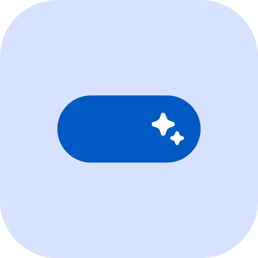

# Expressive Cutout

**An offline dynamic island that follows Google's Material Expressive design.**

Expressive Cutout turns the camera cutout on your Android phone into a small, living
island. Notifications land in it, system events flash through it, and live tiles keep
what's playing, who's calling and how long is left on your timer within a glance of the
top of your screen — all styled with Material Expressive shapes, springs and Material You
colours, and all customisable down to the corner radius.

It runs entirely on your device. The app has no internet permission at all, so nothing can
be uploaded: no accounts, no analytics, no tracking, and it never asks Android which apps
you have installed.

---

## Table of contents

- [Screenshots](#screenshots)
- [Download](#download)
- [Features](#features)
- [Special thanks](#special-thanks)
- [License](#license)

---

## Screenshots

<!-- Screenshots go here. -->

---

## Download

The app is in beta and releases are not published yet — the link above will point to the
APK as soon as the first one is cut. A Play Store listing may follow later.

Requires Android 10 (API 29) or newer. On first launch the app walks you through the three
things it needs: notification access (to mirror notifications), the accessibility service
(to draw the overlay — no screen content is read), and optionally an exemption from battery
optimisation so the island stays reliable in the background.

---

## Features

DISCLAIMER: This app was made as a project to learn Jetpack Compose. I used AI to help me.

| Category | Features |
| --- | --- |
| **Notifications** | Mirrors any app's notifications in the island · icons taken from the notification itself · auto-expand to show title and text, or keep it to a bare app icon · action buttons and inline reply, right from the island · swipe to dismiss clears the notification from the system too |
| **Music tile** | Now-playing title and artist · album art on the collapsed island, optionally spinning while playback runs and stopping when paused · previous / play-pause / next controls on the expanded island |
| **Phone tile** | Live ongoing call with the caller's name, contact photo and running duration · the dialer's own call actions, such as Hang up · incoming-call view with the caller's number and answer / decline buttons, opening the in-call screen on tap · optional taller two-row incoming layout with full-width buttons |
| **Timer tile** | Mirrors the running countdown from your clock app, including Android 16+ live-update timers · the clock app's real buttons and labels, such as Add 1 min and Reset · Pause flips to Resume live |
| **System events** | Charging started and stopped · battery low · Wi-Fi connected and lost · headphones in and out · USB connected and removed · device unlocked |
| **Per-event customisation** | Pick any icon from the full Material icon library, with a search filter · animated icons with an optional loop · per-event colour override · per-event on-screen duration · one Material You colour for every event at once |
| **Size & position** | Independent width and height for the normal and expanded island · corner radius set for all corners, top / bottom, or each corner on its own · vertical and horizontal position · live preview with a light / dark background toggle · reset to default |
| **Appearance** | Solid or gradient background, separately for the normal and expanded island, with direction and opacity · soft shadow · outline stroke with its own width and colour · Material You, preset or custom hex colours everywhere · light, dark or system app theme |
| **Action buttons** | Four button styles (Expressive tonal, Expressive filled, Material You, Outlined) · four reply-field styles, including a segmented bar · button colour and height · cancel button on the left or beside send · tile-specific button colours for the phone and timer tiles |
| **Animations** | Expressive spring or ease-in-out style · slow / default / fast speed · big / normal / small bounce · animation duration scaled from 0 to 1000 ms · tuned against a live example |
| **Behaviour & gestures** | Auto-collapse after a delay, or stay expanded until tapped · disappear entirely when it shrinks · swipe up to shrink · swipe sideways to dismiss, with a direction and a choice of which sizes it applies to · hide on lockscreen, tearing the overlay down completely so it uses no resources |
| **Privacy** | No internet permission at all, so nothing can leave the device · no analytics or tracking · never queries your installed apps · every permission explained in-app, and the whole manifest is documented on the Permission details screen |
| **Testing** | Send yourself a test notification with reply and action buttons · trigger a test ongoing call and a test incoming call · preview any system event on the island from its detail screen |

---

## Permissions

Your data privacy matters. The app only requests the absolute minimum permissions required to function. Plus, it has no INTERNET access permission, which means nothing is sent on the Internet: no analytics, no usage data, no notification content stored anywhere. Everything stays on your phone. Always. Here are the required permissions:
- Notification access: to display your notifications in the dynamic island,
- Accessibility service: to display over other apps (no screen content is read),  
- Ignore battery optimisation (optional): to make sure battery optimisation does not kill the app,  
- Post notification (optional): for testing purpose,  
- Network state: it can just read if you are connected to the internet (for the Wifi event), but cannot access it

## Special thanks

<!-- Special thanks go here. -->
Even if this project started as a personal app, a lot of existing projects gave me the inspiration I needed, may it be for UI or features: 
- [Dynamic spot](https://play.google.com/store/apps/details?id=com.jamworks.dynamicspot&hl=en)  
- [Material Capsule](https://play.google.com/store/apps/details?id=com.pryshedko.mtisland&hl=en)

And my very special thanks to [Sameerasw's Essential app for Android](https://github.com/sameerasw/essentials) which has an AWESOME Material You Expressive implementation. He is doing a great job and all his apps feel very polished. 

Also, I would like to thank anyone who has or plans to contribute to the project, may it be by reporting bugs or making PRs.

---

## License

Expressive Cutout is free software, licensed under the
[GNU General Public License v3.0](LICENSE). You may use, study, share and modify it; any
distributed derivative must remain under the same licence.
